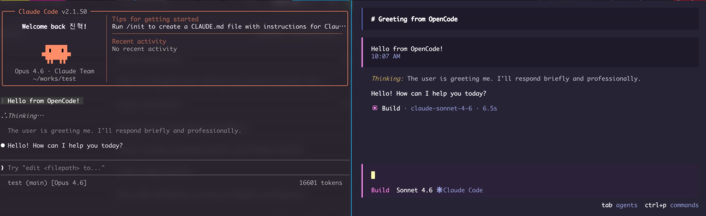

# ai-sdk-agent-sdk

<div align="center">

| |
|:---:|
|  |

</div>

[](https://www.npmjs.com/package/ai-sdk-agent-sdk)
[](https://www.npmjs.com/package/ai-sdk-agent-sdk)

Adapter that exposes Anthropic's Claude Agent SDK (tool use, streaming) as an [AI SDK](https://sdk.vercel.ai/) language model provider.

## Install

```bash
npm install ai-sdk-agent-sdk
# or
bun add ai-sdk-agent-sdk
```

## Usage with opencode

Add the following entry inside the `providers` object in `~/.config/opencode/opencode.jsonc`:

```jsonc
{
  "providers": {
    "claude-code": {
      "npm": "ai-sdk-agent-sdk",
      "name": "❋ Claude Code",
      "options": {
        "setCacheKey": true
        // "baseURL": "https://your-proxy-or-custom-endpoint"
      },
      "models": {
        "claude-opus-4-6": {
          "name": "Opus 4.6",
          "attachment": true,
          "limit": {
            "context": 200000,
            "output": 128000
          },
          "tool_call": true,
          "modalities": {
            "input": ["image", "pdf", "text"],
            "output": ["text"]
          }
        },
        "claude-sonnet-4-6": {
          "name": "Sonnet 4.6",
          "attachment": true,
          "limit": {
            "context": 200000,
            "output": 64000
          },
          "tool_call": true,
          "modalities": {
            "input": ["image", "pdf", "text"],
            "output": ["text"]
          }
        },
        "claude-haiku-4-5": {
          "name": "Haiku 4.5",
          "attachment": true,
          "limit": {
            "context": 200000,
            "output": 64000
          },
          "tool_call": true,
          "modalities": {
            "input": ["image", "pdf", "text"],
            "output": ["text"]
          }
        }
      }
    }
  }
}
```

The `npm` field tells opencode to load the provider from the installed package. Requires Claude Code to be authenticated.

