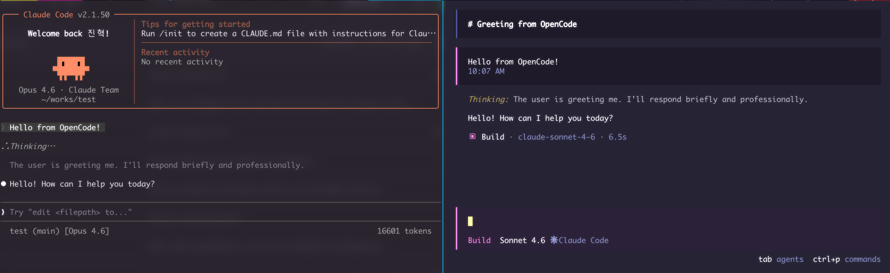

# ai-sdk-agent-sdk

<div align="center">

| |
|:---:|
|  |

</div>

[](https://www.npmjs.com/package/ai-sdk-agent-sdk)
[](https://www.npmjs.com/package/ai-sdk-agent-sdk)
[](https://github.com/zenyr/ai-sdk-agent-sdk)

> **Warning:** This package is experimental. It works great — until it doesn't. Anthropic may change the Claude Agent SDK at any time, and this adapter will heroically attempt to keep up. Pin your versions. You have been warned. _(Probably fine though.)_

Adapter that exposes Anthropic's Claude Agent SDK (tool use, streaming) as an [AI SDK](https://sdk.vercel.ai/) language model provider.

## Install

```bash
npm install ai-sdk-agent-sdk
# or
bun add ai-sdk-agent-sdk
```

## Entry points

- `ai-sdk-agent-sdk`: package root legacy compatibility entry for OpenCode and other v2-style consumers
- `ai-sdk-agent-sdk/v3`: spec-first provider entry without OpenCode compatibility overlays
- `ai-sdk-agent-sdk/v2`: explicit legacy v2 compatibility entry

## Usage with opencode

Add the following entry inside the `providers` object in `~/.config/opencode/opencode.jsonc`:

```jsonc
{
  "providers": {
    "claude-code": {
      "npm": "ai-sdk-agent-sdk",
      "name": "❋ Claude Code",
      "options": {
        "setCacheKey": true,
        // "baseURL": "https://your-proxy-or-custom-endpoint"
      },
      "models": {
        "claude-opus-4-6": {
          "name": "Opus 4.6",
          "attachment": true,
          "limit": {
            "context": 200000,
            "output": 128000
          },
          "tool_call": true,
          "modalities": {
            "input": ["image", "pdf", "text"],
            "output": ["text"]
          }
        },
        "claude-sonnet-4-6": {
          "name": "Sonnet 4.6",
          "attachment": true,
          "limit": {
            "context": 200000,
            "output": 64000
          },
          "tool_call": true,
          "modalities": {
            "input": ["image", "pdf", "text"],
            "output": ["text"]
          }
        },
        "claude-haiku-4-5": {
          "name": "Haiku 4.5",
          "attachment": true,
          "limit": {
            "context": 200000,
            "output": 64000
          },
          "tool_call": true,
          "modalities": {
            "input": ["image", "pdf", "text"],
            "output": ["text"]
          }
        }
      }
    }
  }
}
```

`setCacheKey: true` is recommended when the caller can provide a stable conversation key. This package reads `promptCacheKey` / `x-conversation-id`, maps that key to a persisted Claude Agent SDK `sessionId`, and resumes the same Claude session on later turns. Session reuse is isolated by model plus runtime fingerprint, including `baseURL`, so the same cache key does not cross-resume into a different upstream proxy.

The `npm` field tells OpenCode to load the package root legacy compatibility entry. This keeps the v2-style `finishReason`/`finish`/`reason` shape that OpenCode expects. Ambient Claude login is the default auth path. If you pass `apiKey`, that explicit key is used instead.

## Usage as a pure provider core

If you want the spec-first provider entry without the OpenCode compatibility overlays, import the explicit v3 entry:

```ts
import { anthropic, createAnthropic } from "ai-sdk-agent-sdk/v3";
```

Provider factory options also support Agent SDK passthrough settings via `experimental_agentSdk`:

```ts
import { createAnthropic } from "ai-sdk-agent-sdk/v3";

const provider = createAnthropic({
  apiKey: process.env.ANTHROPIC_API_KEY,
  experimental_agentSdk: {
    cwd: "/path/to/workspace",
    debug: true,
  },
});
```

Use the root entry when you need OpenCode-oriented legacy compatibility behavior. Use `ai-sdk-agent-sdk/v3` when you want the clean v3 provider surface directly.

## Development workflow

- Git hooks are managed by Lefthook (`bun install` runs `prepare` and installs hooks).
- `pre-commit` runs Biome on staged files.
- `commit-msg` enforces Conventional Commits via commitlint.
- Biome is configured for a compact style (`lineWidth: 120`, `arrowParentheses: asNeeded`).

## Changelog

[packages/main/CHANGELOG.md](./packages/main/CHANGELOG.md)
